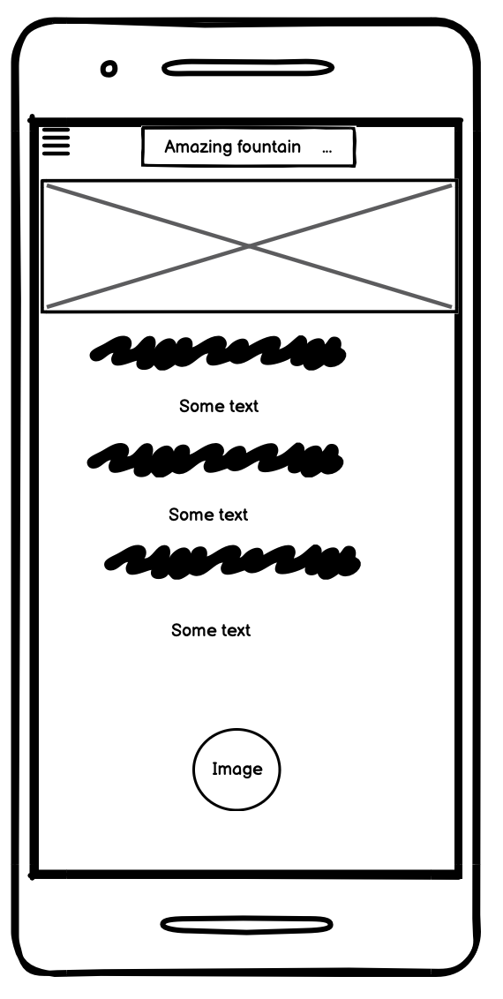

# Table of Content

* Project Goals
* Target Audience
* Design
  * Wireframes
  * Colour Scheme
  * Typography
  * Imagery
* Features
   * General Features on each page
* Technologies Used
* Testing
* Remote & Local Development
  * How to Fork
  * How to Cone
* Credit

# Amazing Fountain
***
This is my first project with Code Institute. This project is about the most beautiful fountains in the world. It was created for people who like to travel and love the fountains like me. This project will help them get information about each fountain, where the fountains are located, and why it's so special. I was motivated to create this project so that people could find out what beautiful fountains exist in the world; they are dancing fountains, the highest fountains. After spending at least 5 minutes near these fountains, you fill yourself up with energy and get amazing fillings, and with this project, I want to motivate other people to visit them and enjoy the pleasure that I got when I saw Dubai’s tallest fountain.

## Project Goals
***
* As a creator, I want the user to know about the most beautiful fountains in the world.
* As a creator, I want the user will enjoy this web site.
* As a creator, I want it to be convenient and easy for the user to use the site.
 * As a creator, I want the user to be able to get interesting facts about fountains.
 * As  creater, I want the user to be able to see pictures of the fountains.
 * As creater, I want to provide clear information for potential visitors.

 ## Target Audience
 ***
 * As a user, I want to get clear and useful knowledges.
 * As a user, I want to easily navigate from page to page across all devices.
 * As a user, I to be able to be easily navigate through this site.
 * As a user, I want to be able to access their social media links.

 ## Design
 ***

 #### Wireframes

 Wireframes were created for mobile and desktop.

  * Desktop wireframes

 

 

 

  * Mobile wireframes

 

 
 
 

### Colour Sheme
The colors were chosen as they complemented the light blue and purple color of the picture on the main page.The colour palette was created using the [Coolors](https://coolors.co/adb2dc-898fbf-b5caec-607bcd-000000-ffffff)

### Typography

Typography
[Google Fonts](https://fonts.google.com/about) was used for the following fonts:

Roboto is used for headings on the site. It is a serif font.
Inter is used for the title on the site. It is a sans-serif font.

### Imagery

All images used were taken from free sources which is credited in the credits section.

## Features
***
The site contains common features such as a navigation bar and footer, familiar to all internet users. the user can feel comfortable exploring the pages, make return visits, and enjoy a positive experience.

### Logo
The Logo is in the middle of the page with large black  letters, the font was used for this is "Inter".

### Navigation Buttons
Featured on all three pages, the full responsive navigation bar includes links to the  Home page, Gallery and Contact Us page and is identical in each page to allow for easy navigation.

  1. This section will allow users to easily navigate from page to page across all devices.

  2. Navigation bar will always stay on top of the screen when scrolling to allow easy access to other pages.

  

### Facts About Fountains
 the user will be able to read about the most intresting facts about fountains:
  1. When the first fountain appeared.
  2. Who create the first fountain.
  3. Why are fountains called "fountain".
  4. Which is the oldest fountain in the world.

  
### Gallery
Gallery page is a page where the user can see beautiful pictures of each popular fountain, above each picture there will be a small description about the fountain,such as where is located , when it appeard and in which countrt or city is located.

### Contact Us
  On the page "Contact Us" user will be able to choose his favorite fountain, which even in the future he will be able to visit.

  

### Footer 
This is the regular footer with the social icons displayed:

  ## Technologies Used
  ***

  * HTML5 - basic coding to build a website for Amazing Fountain.
  * CSS3 - use for styling the website.
  * Gitpod - used to create website and writing code.
  * GitHub - to store and save the process and files used on the website.
  * [Pexel](https://www.pexels.com/ru-ru/)- got all images for website .
  * [HTML Validator](https://validator.w3.org/) - to validate HTML.
  * [CSS Validator](https://jigsaw.w3.org/css-validator/) - to validate CSS.
  * [I am Responsive](https://ui.dev/amiresponsive) - was to used to create a shot to see responsiveness on different devices.
  * [Balsamiq](https://balsamiq.com/wireframes/?gclid=Cj0KCQiAxbefBhDfARIsAL4XLRoOUITVfOAhZoGiIudY76dcyjWwzW85ebwsCmrh0oyJ7BBf97dGoQ4aAhqOEALw_wcB) - to create Wireframes.
  *  - resources relating to layouts using Flexbox.

 
 ## Testing 
 ***

The site had been tested in Chrome,Firefox without noticable trouble.
The site was tested on numerous devices and it worked well on all. The devices used for testing were a ASUS Vivobook Laptop, an iMac, an iphone 11 iphone 6 and a Samsung s22.

 * No issues found

 

 * no issues found

 

 * I've tested my deployed project using the Lighthouse Audit tool for all of my pages to check for any major issues.
    * Mobile Home Page
 
   *  Desktop Gallery Page
 
 
  * Manually check :

 | Expected Results | Test Taken | Pass/Fale |
 |------------------| -----------| ------------|
 | Navigation links to relevant pages| Click on each navigation bar | Pass |
 | 	Social media icons in the footer link to the correct 
 |  external link and open in new tab | Click on each footer icons | Pass |
 | Contact us form can not be submitted without required details| Fill in certain fields in form to check if it's allowed to submit| Pass|
 | Contact us form redirects to thankyou.html | Fill in all form fields and click submit | Pass |
 | Website works with different browsers | Tested Chrome, Firefox, Safari | Pass |
 | Website looks well with different sized screens | Test with devtools for different screen sizes, also tested with iphone 11, Ipad Air| Faile |

## Deployment & Local Deployment
 ***
 #### Deployment
 * Github Pages was used to deploy the live website. The instructions to achieve this are below:

1. Log in/Sign Up to Github.
2. Find the Castleisland-Christmas-Markets repository.
3. Go to Settings > Pages.
4. In the Source section, choose Main from the drop down select branch menu. Select Root from the drop down select folder menu.
5. Click Save. Your live Github Pages site is now deployed at the URL shown.

#### Local Deployment

 * How to Clone

1. Log in/Sign Up to Github.
2. Find the Castleisland-Christmas-Markets repository.
3. Click on the code button, select whether you would like to clone with HTTPS, SSH or GitHub CLI and copy the link shown.
4. Open the terminal in your code editor and change the current working directory to the location you want to use for the cloned directory.
5. Type 'git clone' into the terminal and then paste the link you copied in step 3. Press enter.

* Fork the GitHub Repository

1. Forking the GitHub Repository makes a copy of the original repository on our GitHub account; allowing us to view and/or make changes without affecting the original repository and can be done by using the following steps.

2. Log in to GitHub and locate the repository: [Amazing Fountains](https://github.com/Aliona83?tab=repositories)
Once in the repository, navigate to the "Fork" button at the top right of the page; just above the settings button on the menu.
3. You should now have a copy of the original repository in your GitHub account.
 
 ## Credit 

 ***
